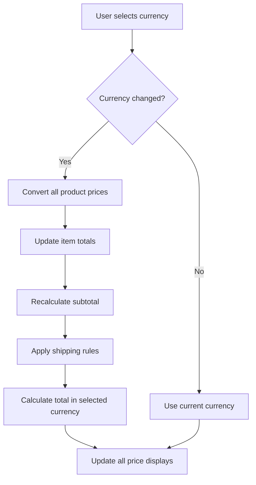
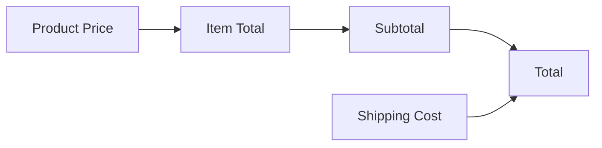

# Design Document: Currency Conversion Fix

## Overview

This design document outlines the approach to fix the currency conversion issue in the Angel Marketplace e-commerce platform. Currently, when users change the currency in the cart or checkout pages, the subtotal and shipping costs are correctly converted to the selected currency, but the total cost is not consistently updated to match. This creates confusion for users and may lead to incorrect pricing information being displayed.

The solution will ensure consistent currency conversion and display across all price elements in the cart and checkout pages, maintaining a seamless user experience when switching between currencies.

## Architecture

The Angel Marketplace platform uses a PHP-based architecture with JSON files for data storage. The currency conversion functionality is primarily handled in the following components:

1. **Functions Module** (`includes/functions.php`): Contains utility functions for price formatting and currency conversion.
2. **Cart Page** (`cart.php`): Displays the shopping cart with item prices, subtotal, shipping, and total.
3. **Checkout Page** (`checkout.php`): Handles the checkout process, including currency selection and payment processing.
4. **Settings Configuration** (`data/settings.json`): Stores currency configuration, including available currencies and their symbols.

The issue appears to be in how the total cost is calculated and displayed when a currency is changed, particularly in the cart page where the subtotal shows in one currency (e.g., Naira) while the total shows in another (e.g., Euro).

## Components and Interfaces

### 1. Currency Conversion Functions

The core of the fix will involve ensuring that the currency conversion functions are consistently applied across all price calculations. The main functions involved are:

- `formatPrice()`: Formats a price with the default currency symbol.
- `formatProductPrice()`: Formats a product price with the appropriate currency symbol.
- `formatPriceWithCurrency()`: Formats a price with a specific currency symbol.
- `getProductPrice()`: Gets the appropriate price for a product based on the current currency.

These functions need to be used consistently throughout the cart and checkout pages to ensure all prices are displayed in the same currency.

### 2. Cart Page Updates

The cart page needs to be updated to ensure that when displaying prices, it consistently uses the same currency for all elements:

- Item prices
- Item totals
- Subtotal
- Shipping cost
- Total cost

The cart page should handle currency selection, ensuring all price displays are updated accordingly.

### 3. Checkout Page Updates

The checkout page should use the currency selected in the cart page rather than requiring users to select it again:

- Item prices
- Item totals
- Subtotal
- Shipping cost
- Total cost

The currency selection from the cart page should be persisted (using session storage or cookies) and automatically applied in the checkout page.

### 4. Currency Persistence Mechanism

A mechanism will be implemented to persist the user's currency selection between the cart and checkout pages:

- Store the selected currency in the user's session
- Retrieve the currency selection when loading the checkout page
- Apply the selected currency to all price calculations and displays in checkout

## Data Models

The existing data models will be used without modification:

1. **Product Model**: Contains product information, including multi-currency pricing in the `prices` field.
2. **Cart Model**: Stores the items in the user's cart, with product IDs and quantities.
3. **Order Model**: Records completed orders, including the currency used for the transaction.
4. **Settings Model**: Contains currency configuration, including available currencies and their symbols.

## Error Handling

The following error scenarios will be addressed:

1. **Missing Currency Conversion**: If a product doesn't have a price in the selected currency, fall back to the default currency.
2. **Invalid Currency Selection**: If an invalid currency is selected, default to the system's default currency.
3. **Calculation Errors**: Ensure that all calculations are performed with proper precision to avoid rounding errors.

## Testing Strategy

The following testing approach will be used to verify the fix:

1. **Unit Testing**:
   - Test currency conversion functions with various inputs.
   - Test price formatting functions with different currencies.

2. **Integration Testing**:
   - Test the cart page with products in different currencies.
   - Test the checkout page with currency switching.

3. **User Acceptance Testing**:
   - Verify that all price displays are consistent when switching currencies.
   - Verify that the total cost matches the sum of subtotal and shipping in the selected currency.

## Implementation Considerations

1. **Consistency**: Ensure that all price displays use the same currency formatting functions.
2. **Performance**: Minimize redundant currency conversions to maintain performance.
3. **User Experience**: Ensure that currency changes are reflected immediately and consistently across all price elements.
4. **Backward Compatibility**: Maintain compatibility with existing order processing and payment systems.

## Diagrams

### Currency Conversion Flow

### Price Display Components

